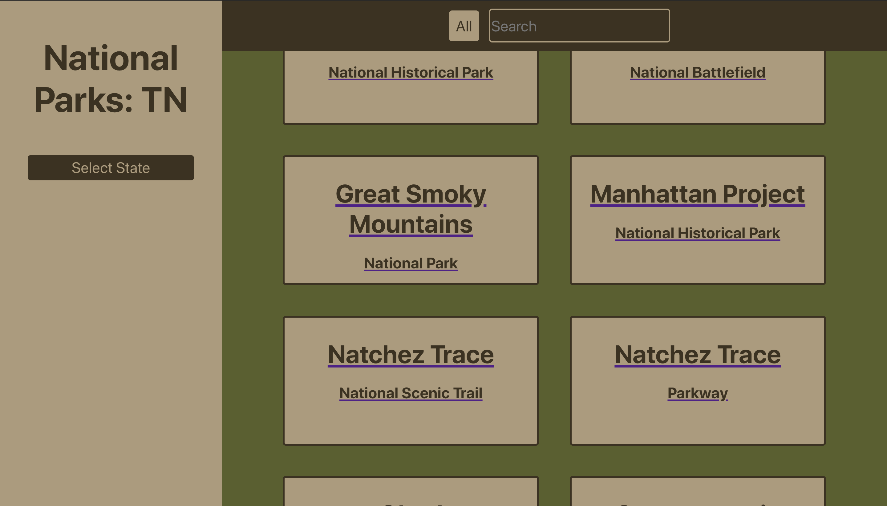
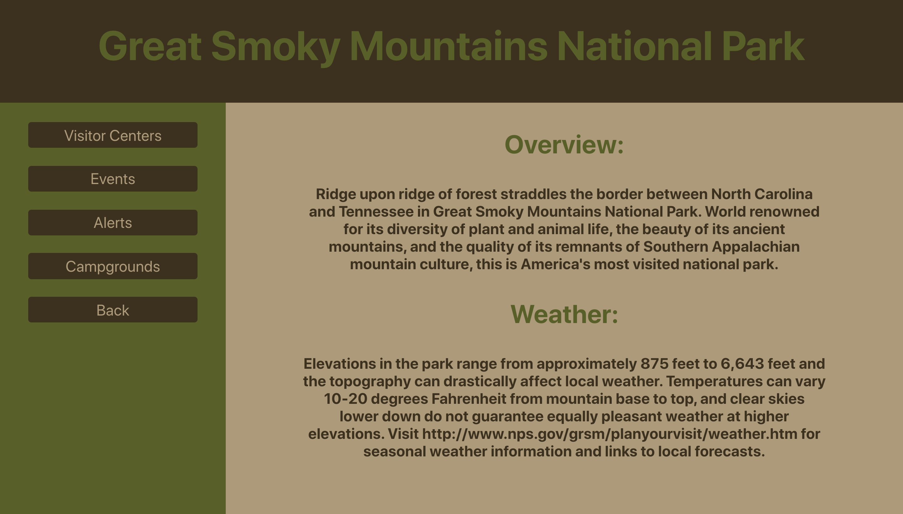
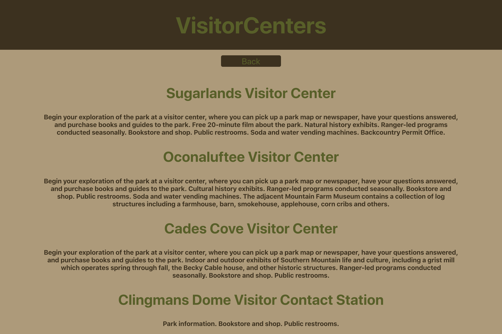

# National Parks

National Parks is a directory in which the user can filter national parks by state and search by name. The user can click on a park and view general information. After selecting a park, the user can access information about current events, alerts, visitor centers, and campgrounds. 

## Created by:

- [Sam Coleman](https://github.com/SamuelColeman)

## View National Parks locally on your computer

Clone the repo to your terminal :``` $ git clone https://github.com/SamuelColeman/national-parks.git```

Once cloned down add ``` cd national-parks ``` to your terminal

Run ``` $ npm install ``` in your terminal

To open the app on your web server run ``` $ npm start ```

## Tools

  - React
  - Redux
  - React Router
  - Jest
  - Enzyme
  
## Screenshots of National Parks







